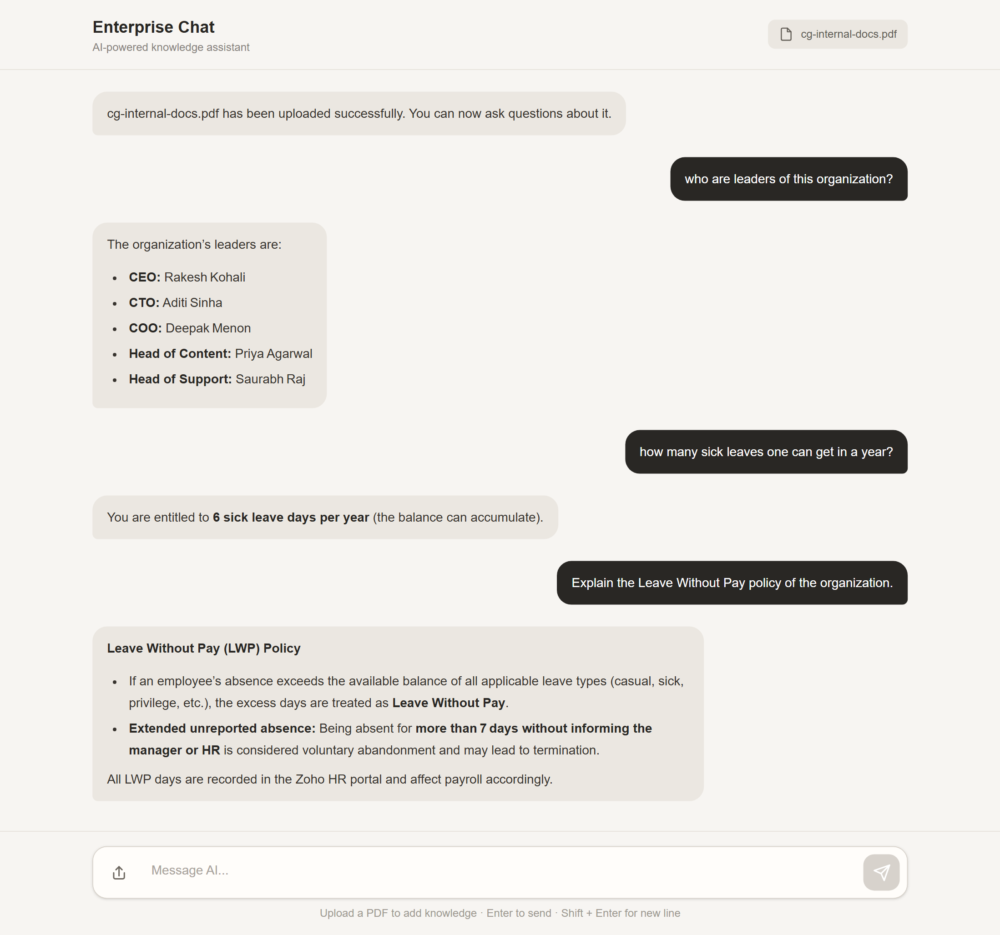

# Enterprise RAG Chatbot

A Retrieval-Augmented Generation (RAG) chatbot that lets employees upload internal PDF documents and ask questions about their content in natural language.



The system parses PDFs, splits them into chunks, generates embeddings with Gemini, stores the vectors in Pinecone, retrieves the most relevant chunks for a query, and uses an LLM through Groq to generate a grounded answer.

## Features

- Upload internal PDF documents through the web interface
- Chunk documents with `RecursiveCharacterTextSplitter`
- Generate embeddings with Gemini and store them in Pinecone
- Retrieve the most relevant chunks via semantic similarity search
- Generate grounded answers using an LLM through Groq
- Session-based multi-turn conversations
- Markdown-formatted AI responses

## Architecture

```text
PDF Upload → Parse → Chunk → Embed (Gemini) → Store (Pinecone)

User Question → Embed → Pinecone Similarity Search → Top Chunks
              → Context + Question → Groq LLM → Answer
```

## Tech Stack

**Frontend:** React, Tailwind CSS, React Markdown

**Backend:** Node.js, Express.js, Multer

**RAG:** LangChain JS, `@langchain/google-genai`, `@langchain/pinecone`

**AI / LLM:** Gemini Embeddings, Groq API (`openai/gpt-oss-120b`)

**Vector DB:** Pinecone (cosine similarity)

**Other:** `pdf-parse`, NodeCache, UUID-based session IDs

## Backend API

| Endpoint           | Description                                         |
| ------------------ | --------------------------------------------------- |
| `GET /api/`        | Health check                                        |
| `POST /api/upload` | Upload a PDF (`multipart/form-data`, field: `file`) |
| `POST /api/chat`   | Send a question + `sessionId`, get an answer        |

**Chat example:**

```json
// Request
{ "message": "How many sick leave days can an employee get?", "sessionId": "your-session-id" }

// Response
{ "response": "An employee can get 6 sick leave days per year." }
```

## Installation

```bash
# Backend
npm install
npm run dev

# Frontend
npm install
npm run dev
```

The backend runs on `http://localhost:5000`, and the frontend talks to `http://localhost:5000/api`.

## Session Management

Each client generates a session ID on load:

```js
const [sessionId] = useState(() => crypto.randomUUID());
```

The backend uses this ID as the key for `NodeCache`, storing conversation history for up to 24 hours so follow-up questions have context. This is in-memory storage; a production system would use Redis or a database instead.

## Grounding Strategy

The chatbot is instructed to:

- Answer only using retrieved context
- Avoid inventing information
- Say when there isn't enough information to answer
- Keep answers concise, using Markdown when useful

## Document Deletion

Once a PDF's chunks are embedded and stored in Pinecone, the original file can be deleted — retrieval works off the stored vectors, not the source PDF. If the vectors are removed from Pinecone as well, that document's information is no longer retrievable.

## Why RAG Instead of Fine-Tuning?

RAG suits frequently changing enterprise documents better than fine-tuning: updating knowledge just means re-processing the document and refreshing its vectors in Pinecone, with no need to retrain the LLM.

## Current Limitations

This is a prototype. Notable gaps:

- No persistent conversation storage (in-memory only)
- No authentication or document-level access control
- No document deletion from Pinecone via the UI
- No source citations in answers
- No retrieval evaluation or streaming responses

## License

This project is intended as a portfolio / educational project demonstrating a practical RAG architecture.
